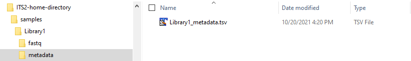

[]()
[]()
[](http://www.gsea-msigdb.org/gsea/login.jsp)
[](https://www.java.com/en/download/)

# ITS2-pipeline

#### Pipeline for analyzing ITS2 amplification sequencing data

A pipeline that incorporates different tools and stages of sequencing reads' analysis to reach a working classification of the fungal taxa in samples

## Table of Contents

- [Background](#background)
- [Install](#install)
- [Usage](#usage)
- [Contributing](#contributing)
- [License](#license)

## Background

ITS2-pipeline is an assembled flow of ITS2 amplification sequence analysis. It takes the user from the first initial stages of demultiplexed fastq's representing ITS2-amplification sequencing results all the way to taxonomic classification of ASVs and additional qiime2 types of outputs.
The overall flow is:

demultiplexed fastq files (PE) --> merged pairs --> trim low quality reads and primer sequences --> within the qiime2 suite: dada2 generation and denoising ASVs --> ITSx facilited extraction of ITS2 regions from merged reads --> naive-bayes based classification of amplicons based on UNITE database version 8 sequences

## Install

### Prerequisites
1) [Python >= 3.6](https://www.python.org/downloads/release/python-360/)
2) [PEAR version 0.9.10](https://cme.h-its.org/exelixis/web/software/pear/)
3) [Cutadapt version 1.17](https://cutadapt.readthedocs.io/en/stable/installation.html) 
4) [ITSx version 1.1b1](https://microbiology.se/software/itsx/)

After downloding or cloning the repository, run:
```sh
pip install -r requisites.txt
```
### UNITE database
The UNITE database files required for classification can be downloaded from:
Abarenkov, Kessy; Zirk, Allan; Piirmann, Timo; Pöhönen, Raivo; Ivanov, Filipp; Nilsson, R. Henrik; Kõljalg, Urmas (2020): UNITE QIIME release for Fungi. Version 04.02.2020. UNITE Community. https://doi.org/10.15156/BIO/786385


## Usage
- A top-level 'home' directory should be selected. 
- Modify the file 'basic_pipeline.py' with your selected home directory name under the define_params() function:
paths['home'] = Path('<your-main-directory>')


- Under that directory, make a directory named 'samples'
- Under samples, for each sequencing library, make a directory with the library name, e.g. 'Library1'
- Under each library directory make three directories:
1) 'fastq' - where sample fastq's of the library should be copied (zipped or unzipped)
2) 'metadata' - place a qiime2 compatible, tab-delimited (.tsv) file with per-sample information. Each sample should at least have a 'sampleid' column.
See the qiime2 documentation for details (https://docs.qiime2.org/2019.10/tutorials/metadata/)

  

python basic_pipe.py <Library name> (e.g. 'Library1')


### Output
Several output files are generated in different subdirectories

Subdirectory | Explanation
---|---
merged | Results of the PEAR merging of R1 and R2
trimmed | Results of trimming primer sequences and filtering out short amplicons with cutadapt
qiime_ready | Results from qiime portion of pipeline (details below)
logs | Logging of pipeline stages
 

Under the qiime_ready directory are several types of output files:

File name | Explanation
--- | ---
.qzv files | for viewing the results in qiime2 viewer (https://view.qiime2.org/)
demux_seqs.qza | merged, trimmed, filtered amplicons from paired reads in library samples
rep-seqs-untrimmed.qza | Dada2 denoised ASVs
stats.qza | Dada2 statistics
table.qza | ASV per sample table
dna-sequences.fasta | fasta format of ASV sequences
its.* files | results files of running ITSx on ASV sequences, the its.ITS2.fasta file has the ITS2 portion
rep_seqs.qza/fasta | Extracted ITS2 portions from ASVs
feature-table.biom | BIOM table of ASV reads per sample
table.from_biom.txt | text version of biom table of ASVs' reads per sample
features.csv | feature IDs
ref_seqs.qza | primer extracted regions of UNITE ver8 sequences
unite_dev_dynamic_otus.qza, ref-taxonomy_unite_dev_dynamic.qza | qiime2 input ready version of UNITE version 8.2 (sh_refs_qiime_ver8_dynamic_04.02.2020.fasta, sh_taxonomy_qiime_ver8_dynamic_04.02.2020.txt)
classifier.qza | naive bayes trained classifier
taxonomy.qza/csv | feature ID, sequence, taxonomomic classification and classification confidence score
summary.csv | concatenated results - ASV feature id, taxonomic classification and score, ITSx classification, reads per sample
taxa_bar_plots.qzv | visual of stack bar plots of ASV relative abundance per sample

## Contributing

Feel free to dive in! [Open an issue](https://github.com/danfeigin/GFlask/issues/new) or submit PRs.

## License

